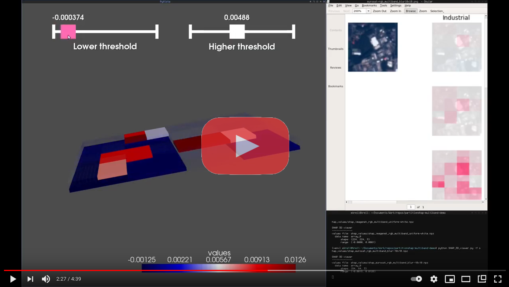

# `PartitionShap` demo: channel-wise explanations of raster-based machine learning models
Exploring PartitionShap on raster datasets of an arbitrary number of bands/channels

These notebooks use our [SHAP fork](https://github.com/conrad-blucher-institute/shap) with modifications to make it easier to use and visualize multi-channel explanations. 
The EuroSAT notebooks use [TorchSat](https://github.com/sshuair/torchsat), a library for working with PyTorch models whose inputs are rasters with arbitraty number of channels. 

### Notebooks:

1. [`PartitionShap`: ImageNet (RGB) demo](PartitionSHAP_ImageNet.ipynb)
2. [`PartitionShap`: EuroSAT (RGB) demo](PartitionShap_EuroSAT_RGB.ipynb)
   * pretrained weights: https://drive.google.com/file/d/14BYvrjem4dbmkmibmmSD2cDq2ZvStfVG/view?usp=sharing
3. [`PartitionShap`: EuroSAT (13-band) demo](PartitionShap_EuroSAT_13bands.ipynb)
   * pretrained weights: https://drive.google.com/file/d/1gYtOpYdMCCMxCkEhRzK1dDyE6tOMIOKa/view?usp=sharing

### 3D SHAP viewer tool (prototype): 

    python SHAP_3D_viewer.py --help
    Usage: SHAP_3D_viewer.py [options]

    Options:
      -h, --help            show this help message and exit
      -f FILE, --file=FILE  Path to 3D SHAP values (.npz)
      -d DATA_NAME, --data_name=DATA_NAME
                            Name of SHAP values in the input SHAP values (.npz)
                            file.
      -e, --show_edges      Show edges of grid elements

